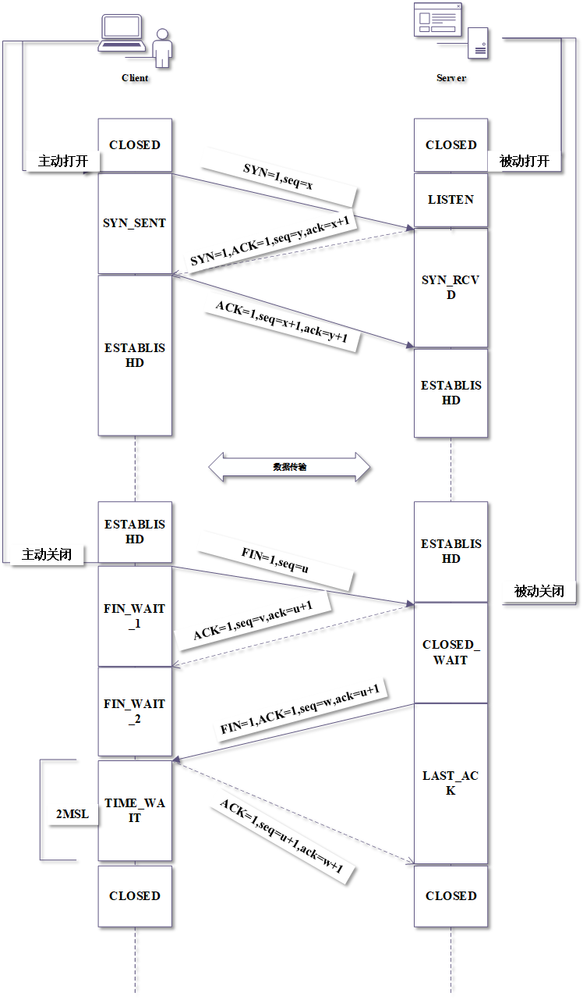

 
***问题1***. 三次握手、四次挥手原理图


***问题2***.  为什么、什么是 TIME_WAIT，有什么策略？

**MSL**: 最长报文段的寿命

**2MSL**: 一个发送和一个回复的最长时间,这个就是`TIME_WAIT`的时间


**可靠的实现TCP连接的终止状态**：
- client 如果直接进入CLOSED状态,则此时的Server的会一直处于等待关闭的状态
- client在接受来自Server的FIN请求后,会给Server回复一个确认报文段,并进入`TIME_WAIT`状态,
  而这个确认报文段可能在传输过程中丢失，此时Client会启动一个计时器,如果在2MSL内再次接受到FIN,则Client会再发一个确认报文;
  Server处于LAST_ACK,如果因为超时没有接收到确认报文,Server会重发一个FIN.

**使旧的重发的确认报文在网络中消失**: 
- Client在重复发送最后的确认报文时,可能有原来的确认报文在网络中滞留,而影响了新的确认报文,这样新的连接和旧的连接就混淆了,
  Client等待2MSL时间，可以使本次连接所产生的数据段从网络中消失，从而保证关闭连接后不会有还在网络中滞留的数据段去骚扰服务端.
  
***问题3***.  Nagel算法伪代码

```
    if 有数据被发送 :
        if 数据包长度大小 >= MSS ,或缓冲队列的数据长度 >= MSS
            发送数据包
        else
            if 有还没确认的数据包 (前一次发送的数据包,还没收到确认)
               放入缓存队列中,直到再次收到一个ack【最多只能有一个未被确认的数据包】
            else
                发送数据包
            end if
        end if
    end if

```

***问题4***. 描述滑动窗口(传输层)、拥塞控制 的基础机制，以及这样设计能带来什么好处
- 滑动窗口在传输层的应用（端到端）:
    - `接收窗口 rwnd`: 接收方根据自己接收缓存的大小,动态调整发送方的窗口大小
    - `发送窗口 cwnd`: 发送方根据当前网络拥塞程序的估计而确定窗口值,大小与网络的带宽和时延有关
    - 发送方根据`cwnd`的大小发送数据;接收方根据自己的接收窗口大小接收数据,并设置确认报文段的首部通知给发送方;
      发送方根据接收的确认报文值滑动窗口,将未收到确认报文的数据控制在rwnd大小之内。
    - 消除了发送方和接收方缓存溢出的可能性
- 拥塞控制（全局）:
    - **慢开始和拥塞避免**: 使用`慢开始算法`后,每经过一个传输轮次,拥塞窗口cwnd就会加倍,指数增长,直到一个规定的门限
      `ssthresh`,然后用`拥塞避免算法`,每经过一个传输轮次,cwnd就加1,当有一次超时时,就把原来的`ssthresh`变为一半,然后
      把cwnd重置为1,再次执行慢开始和拥塞避免算法。
    - **快重传和快恢复**： `快重传`使用了冗余的ack检测网络拥塞,当发送方连续收到三个重复的ack时,直接重传对方尚未收到的报文
       `快恢复`把原来在拥塞避免时的cwnd值改为至ssthresh的一半,而没有直接变为1
       
***问题5***.描述清楚 TCP 与 UDP 的区别与联系，设计一个 TCP 与 UDP 混合使用的技术方案。

- TCP
    - 必须先建立连接
    - 面向字节流的数据传输
    - 每条TCP连接是点对点的
    - 提供可靠的传送,数据传输无差错、无丢失、无重复、有序
    - 全双工通信,允许双方进程在任何时候都可以发送数据
- UDP
    - 无须建立连接
    - 面向报文的
    - 支持一对一、一对多、多对一、多对多的交互通信
    - 不可靠传输
    - 首部开销小，没有拥塞控制
- TCP和UDP混用的技术方案
    - 开发一个聊天室功能包括（视频、语音、信息）这些可用UDP,减少开销
    - 登录功能使用TCP    

    
    
     